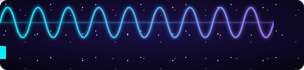

  

Hi, I'm **Mr. Unland**: a computer wizard, mathematician, astronomer, and scientist at heart. I started out teaching code inside Minecraft, and I still believe the best way to learn is **by playing** and **by doing**.

- P2 - Room 10 - 10:55-12:45/10:35-12:25 - $\color{#00f0ff}\texttt{Computer Science Discoveries}$
- P3 - Room 12 - 2:00-3:50/2:10-3:50 - $\color{#00f0ff}\texttt{Computer Science Discoveries}$
- P4 - Room 1 - 8:45-10:35/8:45-10:25 - $\color{red}\texttt{Math 1}$
- P5 - Room 1 - 10:55-12:45/10:45-12:25 - $\color{#00f0ff}\texttt{Computer Science Discoveries}$
- P6 - Room 1 - 2:00-3:50/2:10-3:50 - $\color{#00f0ff}\texttt{Computer Science Discoveries}$
- Office Hours Tuesdays 4-4:50 pm
