<div align="center">

   

```
 Mr.Unland {Tags:["scientist","mathematician","astronomer"]}
```

✦ ˚ ⋆ 🔭 ⋆ ˚ ✦

Adding **$e^{i\pi}$** and **$1$** to get **$0$** *is my favorite spell.*

</div>


<svg width="500" height="500" xmlns="http://www.w3.org/2000/svg">
  <circle cx="550" cy="550" r="140" stroke="green" stroke-width="4" fill="yellow" />
</svg>


I'm **Mr. Unland**: I love coding, showing folks how computers work, and working on interesting Math problems on my time off. I often broke stuff by accident growing up so I had to get real good at fixing it! You can often find me tinkering with thing in my free time, or going on long walks to explore the world. I grew up amongst the stars of the night sky, so I like to take night rides to where I can see them again. 

- P2 - Room 10 - 10:55-12:45/10:35-12:25 - $\color{#00f0ff}\texttt{Computer Science Discoveries}$
- P3 - Room 12 - 2:00-3:50/2:10-3:50 - $\color{#00f0ff}\texttt{Computer Science Discoveries}$
- P4 - Room 1 - 8:45-10:35/8:45-10:25 - $\color{red}\texttt{Math 1}$
- P5 - Room 1 - 10:55-12:45/10:45-12:25 - $\color{#00f0ff}\texttt{Computer Science Discoveries}$
- P6 - Room 1 - 2:00-3:50/2:10-3:50 - $\color{#00f0ff}\texttt{Computer Science Discoveries}$
- Office Hours Tuesdays 4-4:50 pm

<div align="center">


</div>
